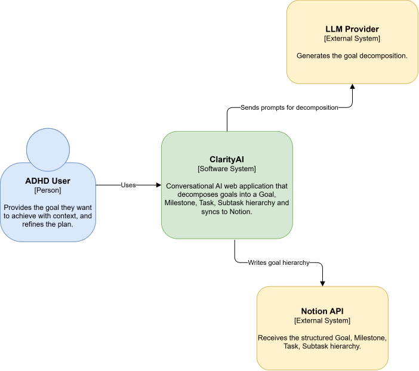
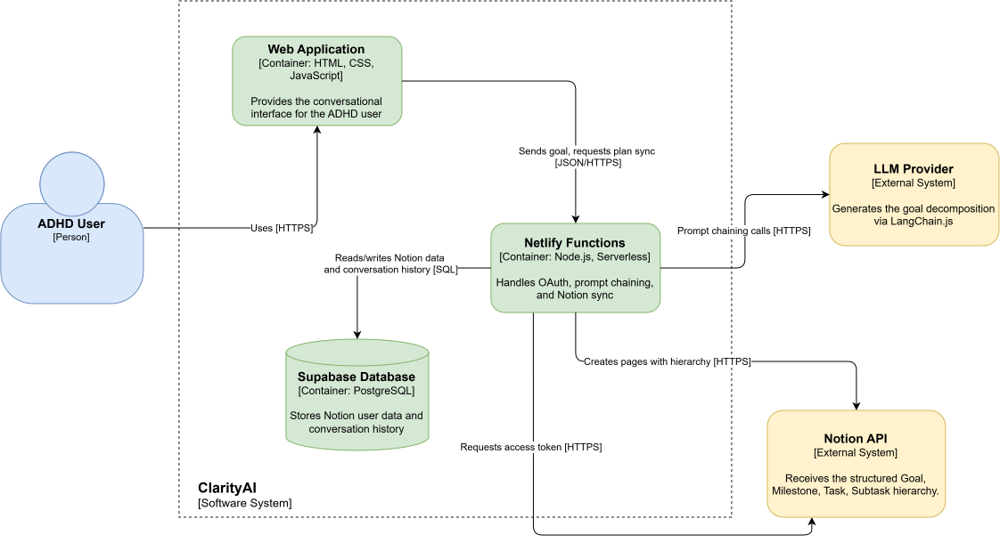
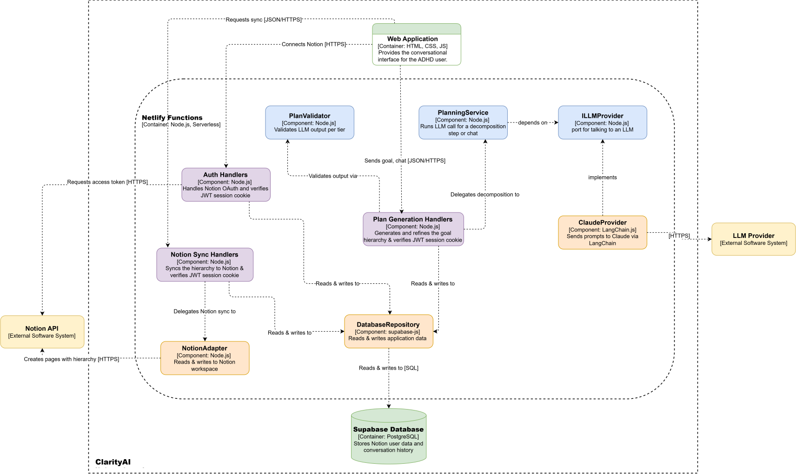
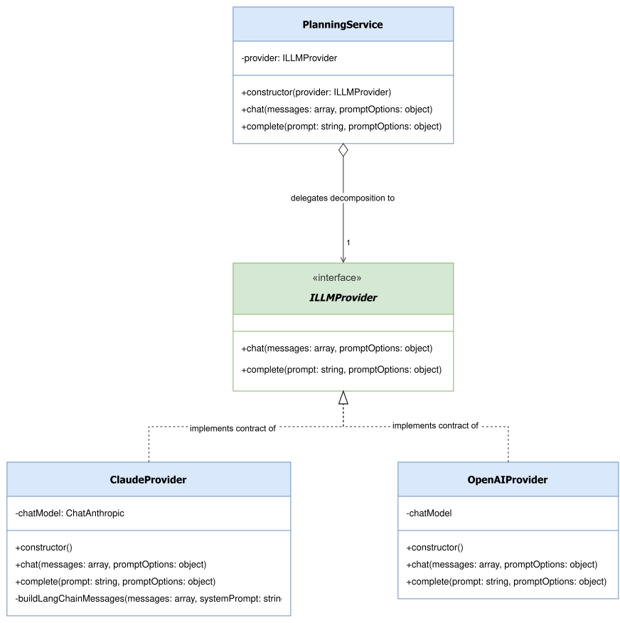
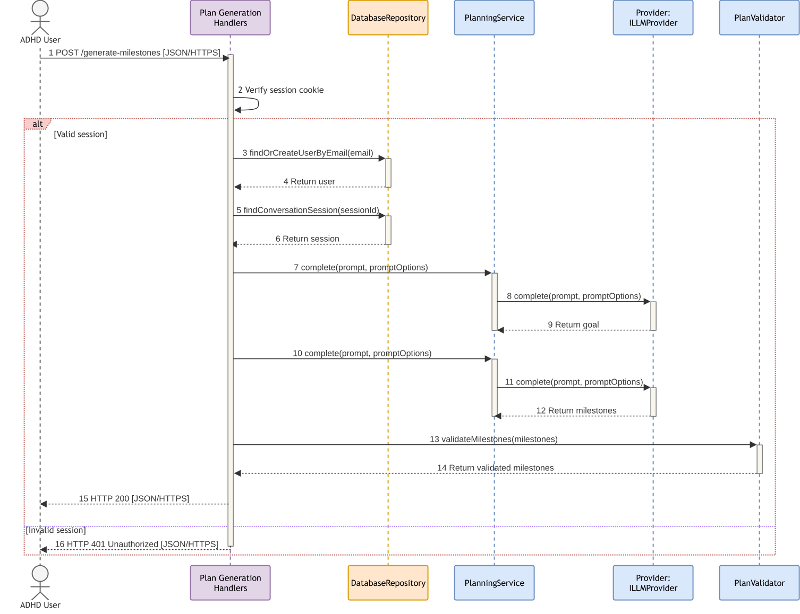
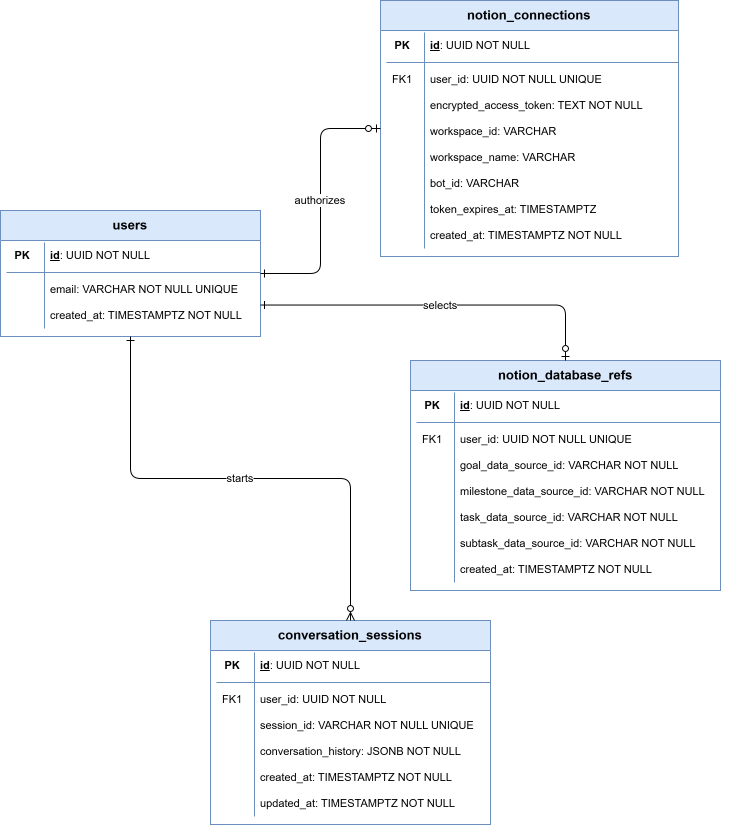

# C4 Diagrams

Architectural diagrams modelling the system using the [C4 model](https://c4model.com/)
(Brown, 2026): Context, Container, Component, and Code.

## Level 1: Context Diagram

A technology-agnostic, high-level view of ClarityAI, its user, and the external systems it depends on.

 
<b>Figure 1.</b> A context diagram for ClarityAI.

 

## Level 2: Container Diagram

The separately deployable pieces and the technology each one runs on.

 
<b>Figure 2.</b> A container diagram for ClarityAI.

 

## Level 3: Component Diagram

The Netlify Functions container's components, and how they connect to each other. Only the LLM path is decoupled behind an interface, ILLMProvider, Notion and Supabase are called directly.

 
<b>Figure 3.</b> A component diagram for ClarityAI's backend.

 

## Level 4: Code Diagrams

### Class Diagram

The Strategy pattern (GoF) used to communicate with the LLM. PlanningService depends on the ILLMProvider interface, not a concrete provider, so ClaudeProvider can be swapped without changing it.

 
<b>Figure 4.</b> A UML Class diagram for ClarityAI's backend.

 

### Sequence Diagram

One request traced end to end: generating milestones. The session check gates access before the Strategy pattern (PlanningService → ILLMProvider) runs twice in one request, once to build the Goal then again to build the Milestones.

 
<b>Figure 5.</b> A UML Sequence diagram for ClarityAI's backend.

 

### Entity Relationship Diagram

The database schema: conversation_sessions exists so state can persist between stateless Netlify Function calls.

 
<b>Figure 6.</b> An Entity Relationship Diagram for ClarityAI's database.

 

## References

* Brown, S. (2026) *The C4 model for visualising software architecture*. Available at:
  https://c4model.com/
