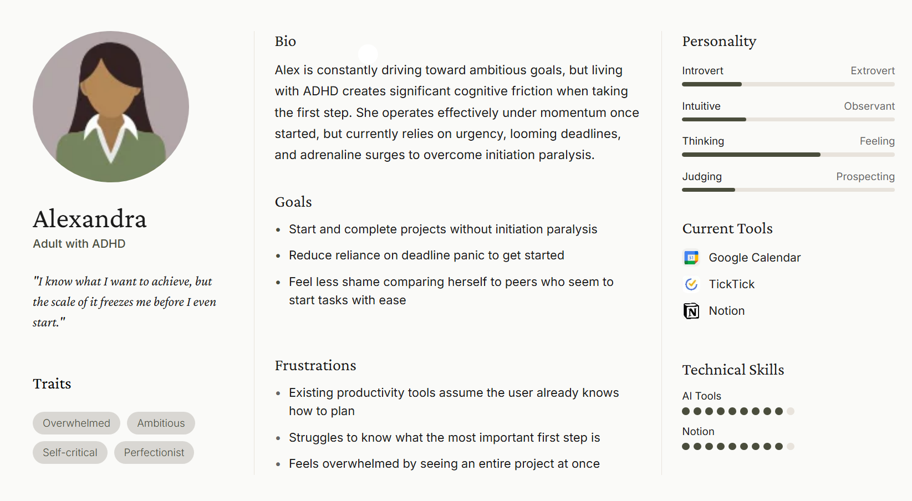
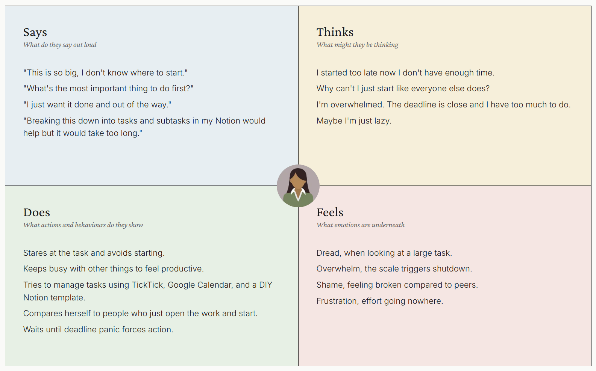
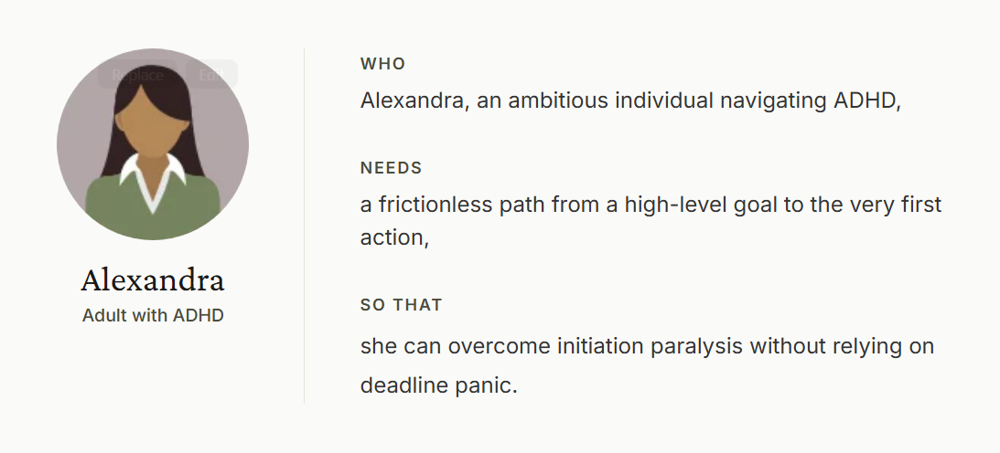

# Empathise & Define

Persona, empathy map, and need statement developed through the empathise and define
phases of the Design Thinking process, grounded in autobiographical design given lived
experience with ADHD (Neustaedter and Sengers, 2012).

## 1. User Persona

 
<b>Figure 1.</b> User persona developed using autobiographical design (Neustaedter and Sengers, 2012).

 

## 2. Empathy Map

 
<b>Figure 2.</b> Empathy map developed using autobiographical design (Neustaedter and Sengers, 2012).

 

## 3. Need Statement

 
<b>Figure 3.</b> Need statement developed using the three-part format (Gibbons, 2019).

 

## References

* Neustaedter, C. and Sengers, P. (2012) 'Autobiographical design in HCI research:
  designing and learning through use-it-yourself', *Proceedings of the Designing
  Interactive Systems Conference*, pp. 514-523.
* Gibbons, S. (2019) *Need Statements and Points of View: 5 Examples*. Nielsen Norman
  Group. Available at: https://www.nngroup.com/articles/need-statement/
