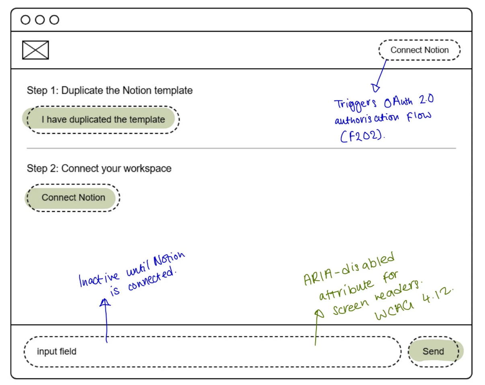
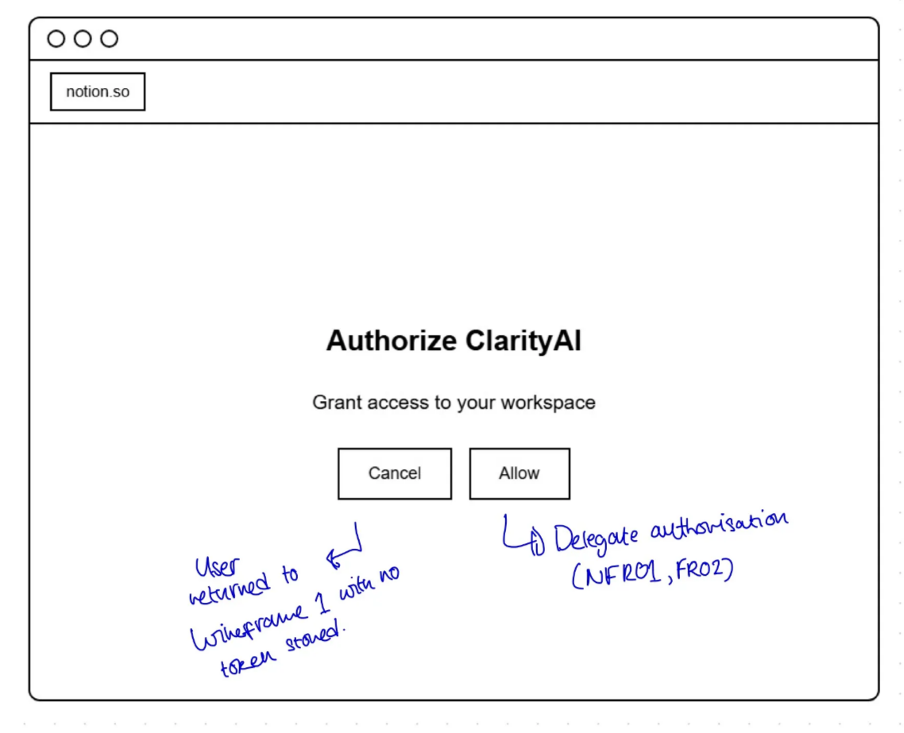
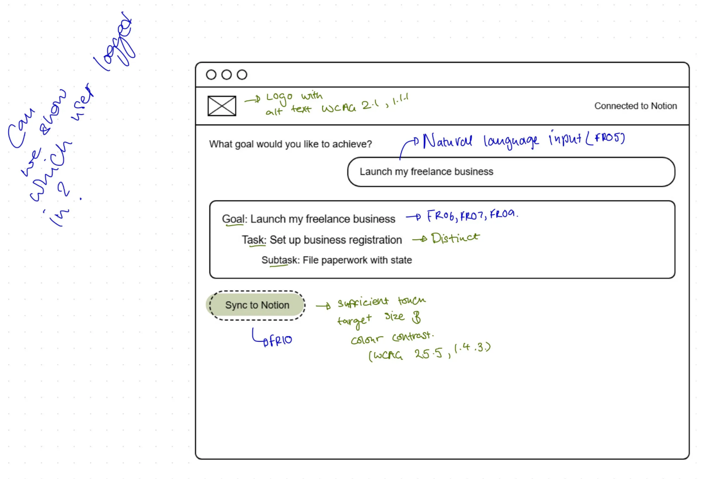
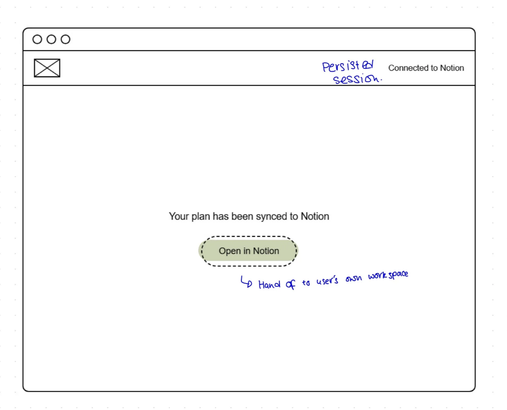
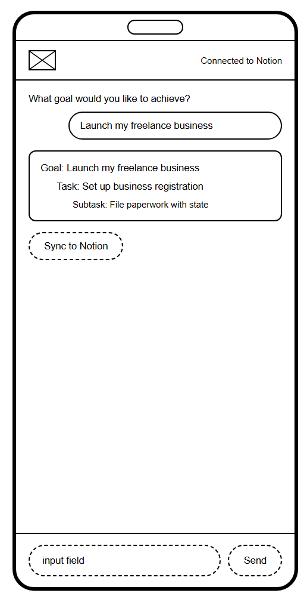
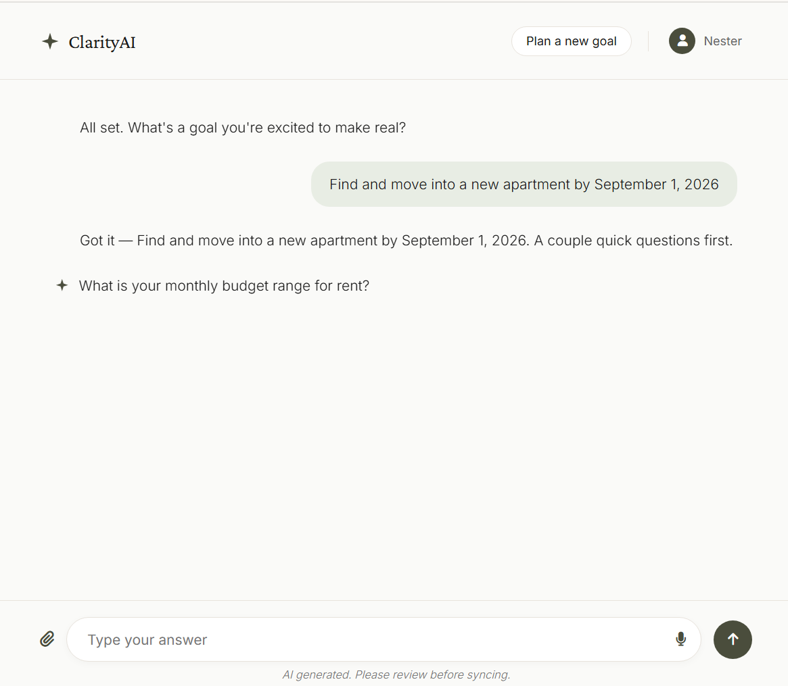

# User Interface Design

The Ideate and Prototype stages of the Design Thinking process, following on from
[Empathise & Define](empathise-define.md): low-fidelity wireframes exploring the
interface, and a high-fidelity prototype refined through autobiographical design
(Neustaedter and Sengers, 2012).

## 1. Wireframes (Ideate)

 
<b>Figure 1.</b> Guided onboarding annotated with the OAuth 2.0 trigger and accessibility notes (WCAG 4.1.2).

 

 
<b>Figure 2.</b> Notion authorisation: delegated OAuth consent screen.

 

 
<b>Figure 3.</b> AI chat interface: captures a goal and breaks it into goals, tasks, and subtasks.

 

 
<b>Figure 4.</b> Notion sync confirmation: shown once a plan has synced to Notion.

 

 
<b>Figure 5.</b> Mobile interface: the same goal/task/subtask breakdown adapted to a smaller viewport.

 

## 2. High-fidelity Prototype (Prototype)

Built in Claude Design from wireframes, then iteratively
refined through direct usability evaluation against the primary persona,
following autobiographical design.

 
<b>Figure 6.</b> High-fidelity prototype (Neustaedter and Sengers, 2012) - <a href="https://claude.ai/code/artifact/d9e1f789-3bc2-4f83-b02b-af5f9544fa56">click to open.</a>

 

## 3. Divergence from Prototype

The delivered system's UI diverged from the prototype due to testing
findings - see the [autoethnographic testing log](../solution-evaluation/).
