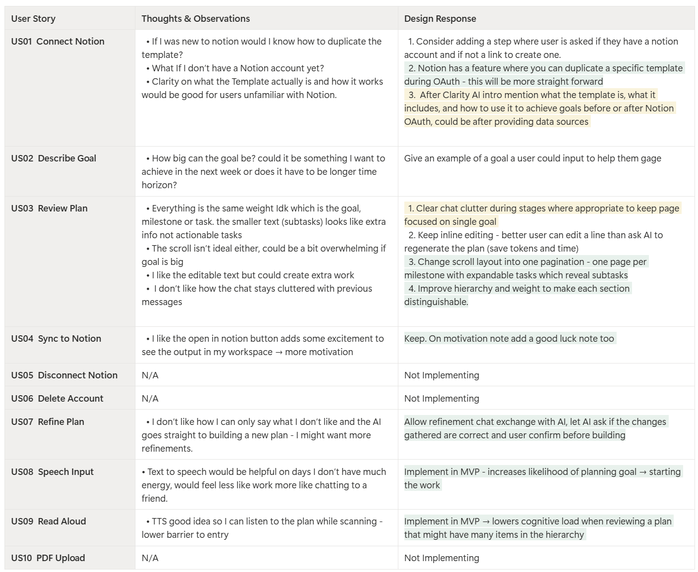
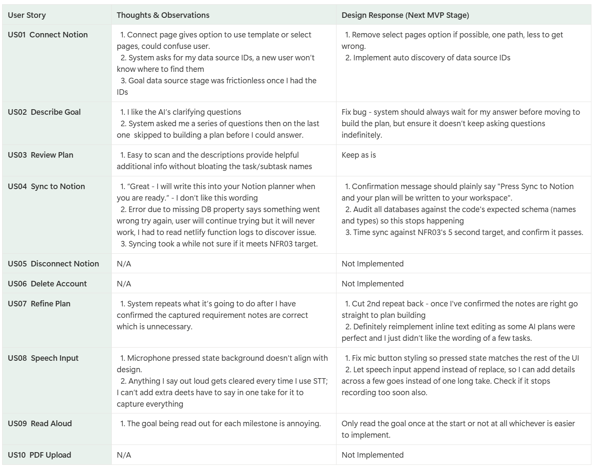

# Autoethnographic Testing

The Test stage of the Design Thinking process, following on from [Ideate &
Prototype](../design-thinking/ideate-prototype.md): both the prototype and the delivered
application were tested first-person as the primary persona, following autoethnography
(Duncan, 2004) and autobiographical design (Neustaedter and Sengers, 2012).

## 1. Prototype Testing Table

Per-user-story testing notes, completed live while testing the prototype.

 
<b>Figure 1.</b> Prototype testing table, completed live following autoethnography (Duncan, 2004).

 

Usability testing provided the design responses above, however not all changes have
been implemented, and remain deferred to a later MVP stage (see colour coding above).
Among the changes implemented, the highest-ROI were: milestone-scoped pagination
replacing continuous scroll, a stricter visual hierarchy between plan levels, and adopting Notion's native template-duplication option during OAuth
- prioritised as the strongest points of friction identified during the
autoethnographic test.

## 2. Delivered System Testing Table

Per-user-story testing notes, completed live while testing the delivered system.

 
<b>Figure 2.</b> Delivered system testing table, completed live following autoethnography (Duncan, 2004).

 

## 3. Need Statement Evaluation

Evaluated against the [need statement](../design-thinking/empathise-define.md#3-need-statement)
(Gibbons, 2019): Alexandra needs a frictionless path from a high-level goal to the very
first action, so that she can overcome initiation paralysis without relying on deadline
panic. The **needs** clause bundles three testable parts - a path, frictionless, and
reaching a first action - evaluated separately below; the **so that** clause is the
actual outcome the whole system is judged against.

| Part | Question | Verdict |
| --- | --- | --- |
| **Needs - path** | Did it give a clear, ordered path? | Yes, largely. Milestone-scoped pagination with expandable tasks, broken down into subtasks and supplemented with descriptions for context, provide the ADHD user with a very clear and ordered path. |
| **Needs - frictionless** | Was that path itself frictionless? | Yes. The user is given a plan without needing to consider every step themselves. Milestones, tasks, and subtasks are distinguishable and easy to scan visually or via read-aloud, which makes reviewing it effortless, and the clarifying-question exchange narrows a goal down without overwhelming the user (US02). |
| **Needs - first action** | Did it lead to a first action? | Yes. The subtasks are small enough that a large ambiguous goal becomes a small, concrete first step, and the Open in Notion functionality leads the user straight to the plan so they can start right away. |
| **So that** | Did it let her overcome initiation paralysis without relying on deadline panic? | Partially. The AI chat and decomposition process is considerably more enjoyable than the manual planning it replaces, but as the literature shows, a clear plan alone does not resolve executive dysfunction or initiation paralysis. However, autoethnographic results remain evidence of the system successfully lowering the barrier to entry. |

Dogfooding surfaced real UX shortcomings - namely onboarding clarity and plan refinement
limitations. Using the system itself must be as straightforward as possible, otherwise it
risks replacing the original source of initiation paralysis, albeit this evaluation reflects
MVP1/2, not a finished product. Therefore the design responses above should reduce this gap
once implemented in later MVP stages.

## References

* Duncan, M. (2004) 'Autoethnography: Critical appreciation of an emerging
  art', *International Journal of Qualitative Methods*, 3(4), pp. 28-39.
* Gibbons, S. (2019) *Need Statements and Points of View: 5 Examples*. Nielsen Norman
  Group. Available at: https://www.nngroup.com/articles/need-statement/
* Neustaedter, C. and Sengers, P. (2012) 'Autobiographical design in HCI
  research: designing and learning through use-it-yourself', *Proceedings of
  the Designing Interactive Systems Conference*, pp. 514-523.
