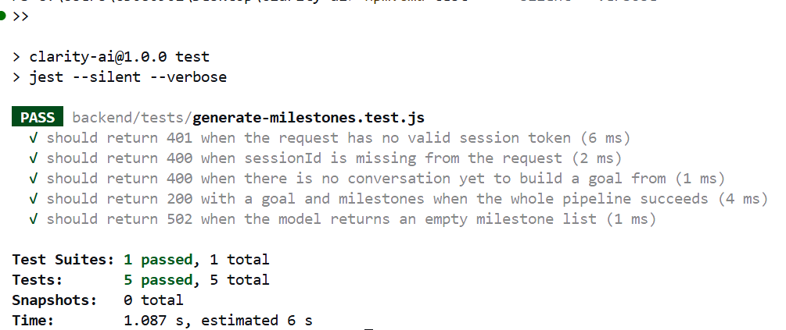
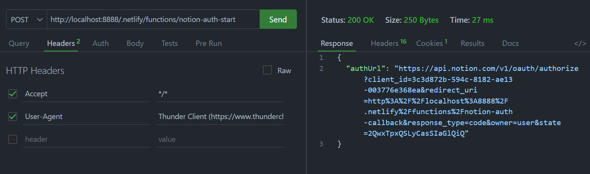
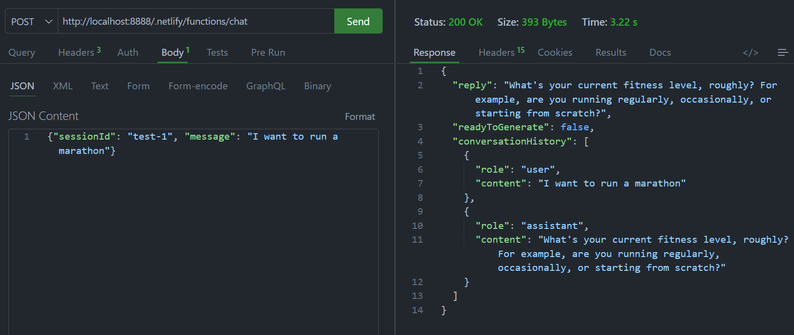
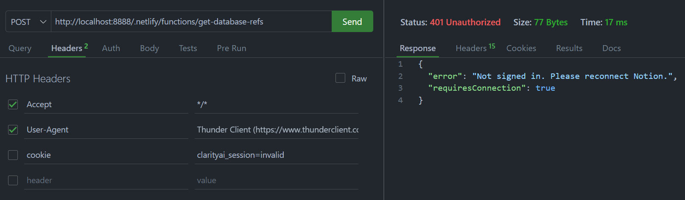
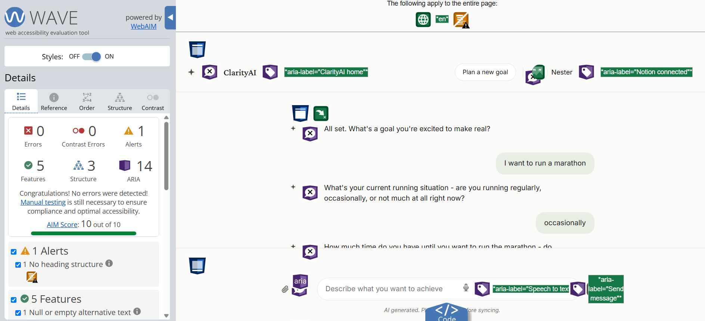
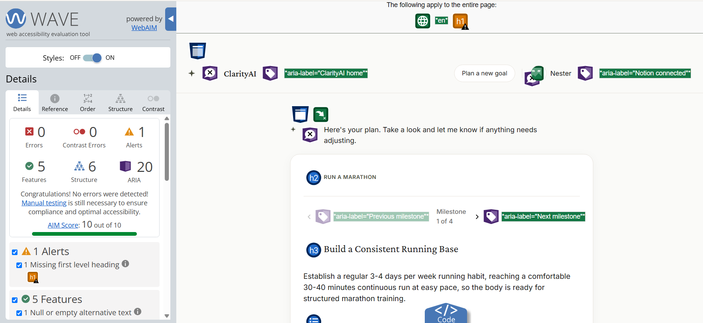
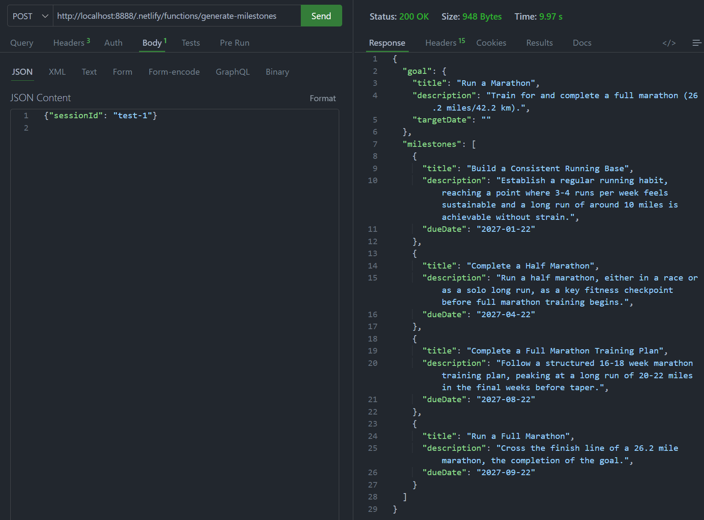

# Testing

## Unit Tests

The following unit test validates the **generate-milestones** handler, including session verification and what happens when the model's output fails validation (FR06, FR08). Mock dependencies are injected via the constructor, demonstrating that the hexagonal architecture (ADR02) enables business logic to be tested without a real database or LLM call.

 
<b>Figure 1.</b> generate-milestones.test.js - Jest unit test result.

## API Tests

The following API endpoint tests validate ClarityAI's Netlify Functions using Thunder Client, one representative endpoint per handler group, confirming correct HTTP status codes and session authentication. `chat` and `get-database-refs` were called with a manually generated session token.

 
<b>Figure 2.</b> POST notion-auth-start API testing result.

 
<b>Figure 3.</b> POST chat API testing result.

 
<b>Figure 4.</b> POST get-database-refs API testing result.

## Security Tests

The following test confirms session authentication is enforced. Calling `get-database-refs` without a valid session cookie is rejected before any database logic runs (NFR05, ADR09).

 
<b>Figure 5.</b> POST get-database-refs with no session cookie, 401 Unauthorized.

## Accessibility Tests

The following WAVE reports evaluate the chat screen and the plan review screen against WCAG standards (NFR06).

 
<b>Figure 6.</b> WAVE report for the chat screen.

 
<b>Figure 7.</b> WAVE report for the plan review screen.

## Performance Tests

The following test times `generate-milestones` against NFR03's 15-second decomposition threshold, using Thunder Client's response time.

 
<b>Figure 8.</b> POST generate-milestones, 9.97s, within the 15-second threshold.

